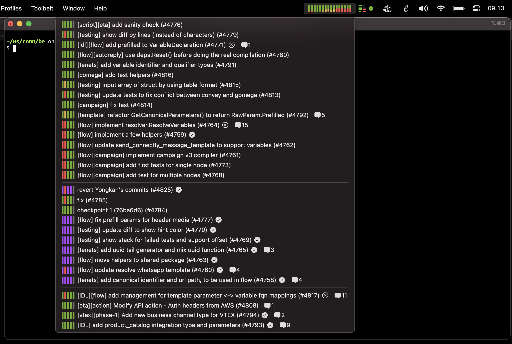
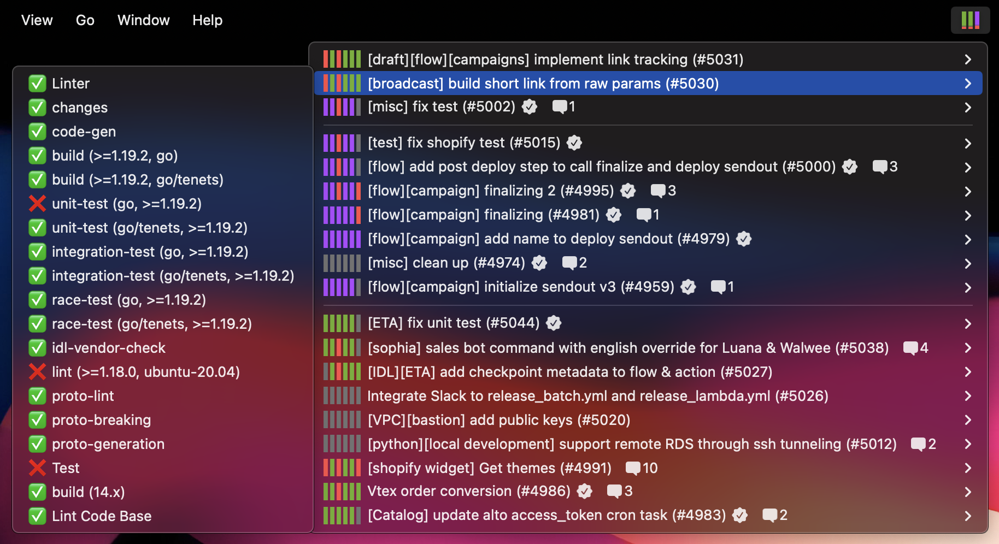

# GitHub PRs on MacOS Menu Bar

*I usually push a lot of PRs in form of stacked PRs to GitHub. It’s quite annoying to go through each PR to see the
check status. So I created this plugin to show my PRs on the menu bar. — Now, everything is just a click away!*

---



## How to use

1. Clone this repository.
2. Copy [`swiftbar.github/_config.example.go`](https://github.com/iOliverNguyen/github.swiftbar/blob/main/swiftbar.github/_config.example.go) to `config.local.go`.
3. Edit `config.local.go` to add your GitHub token, and other configs.
4. Install [direnv](https://direnv.net/docs/installation.html) if neccessary.
5. Run `direnv allow` to allow the configs to be loaded.
6. Run `run build` to generate the executable file `_cli`.

    ```sh
    git clone https://github.com/iOliverNguyen/github.swiftbar
    cd github.swiftbar
    
    # add your configs
    cp swiftbar.github/_config.example.go swiftbar.github/config.local.go 
    vim swiftbar.github/config.local.go
    
    direnv allow
    run build      # generate swiftbar.github/_cli
    ```

7. Download [SwiftBar](https://github.com/swiftbar/SwiftBar/releases/latest/download/SwiftBar.zip).
8. Open SwiftBar.app, select
   the [`github.swiftbar/swiftbar`](https://github.com/iOliverNguyen/github.swiftbar/tree/main/swiftbar) folder as the
   plugin folder.
9. Refresh the plugins. And enjoy!

---



## Features

### 1. Top PRs section

- List of your chosen PRs, sorted by your order.
- You can customize the list of PRs in this section by updating the file `github.swiftbar/__/.prs.txt`.
  It contains a list of PRs that you want to show in this section. **GitHub.SwiftBar** will try extracting PR numbers from
  the file, ignoring text. You can create a command to update the file automatically when you push a stacked PRs.
- If you do not have any PRs in the list, it will fallback to display your most recent PRs, sorted by updated time (last
  3 days for open PRs, and last 1 day for merged PRs).

### 2. My recent PRs section

- List of your recent PRs, sorted by number.
- Last 7 days, include both open and merged PRs.

### 3. Other PRs section

- List of PRs from other people, sorted by number.
- Last 7 days for all PRs with comments.
- Last 3 days for all PRs without comments.
  If you want to keep a PR that you find interesting up to 7 days, just add a comment to it.

### 4. Actions

- Click a PR to open.
- Click a check status to open.

## Other Notes

- Debugging: run the code in verbose mode, and check the log file.

  ```sh
  go  run ./swiftbar.github -v
  ls  ./__
  cat ./__/error.log
  ```
 
- See the [SwiftBar documentation](https://github.com/swiftbar/SwiftBar).
- The plugin refreshes every 30s. To change to duration, rename the file `github.30s.sh`.
- To hide all SwiftBar menu items, and have a clean look: open the references, select "Hide Menu Items".

## Author

This is my experiment and only intend to use for myself. The code uses GitHub
private API, which is not recommended. Consider using the official [GitHub CLI](https://cli.github.com/) instead to get
the CI/CD status plus a lot of useful features.

Thanks to [SwiftBar](https://github.com/swiftbar/SwiftBar) for all the hard works!

— *[Oliver Nguyen](https://olivernguyen.io)*
